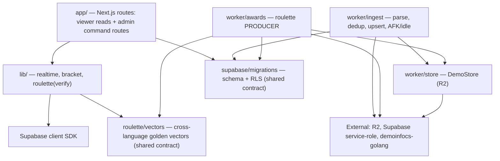
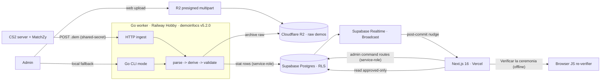
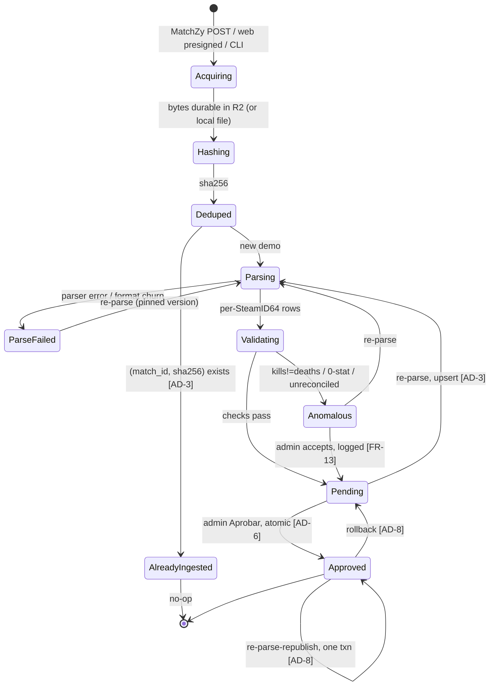
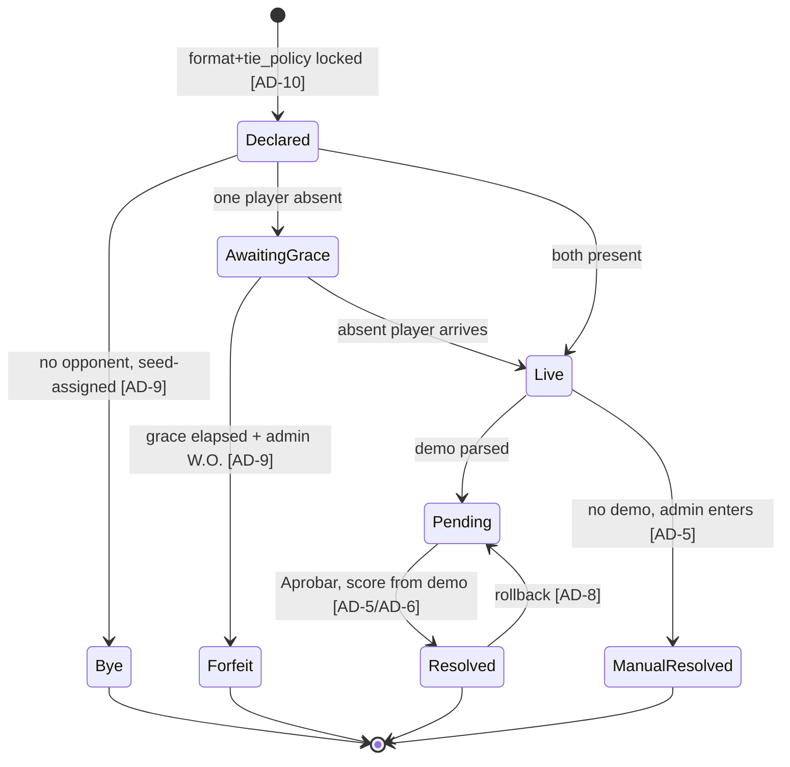
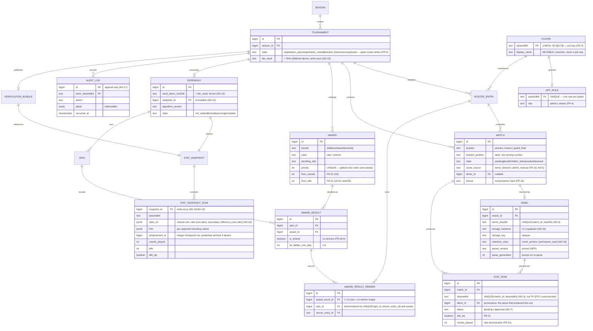

# Architecture Spine — InclusivCup (CS2 Tournament)

## Design Paradigm

A **demo-sourced, single-writer derivation pipeline** feeding an **RLS-gated published-read
projection (CQRS-lite)**, with a **deterministic provably-fair recomputation** for the ceremony.
Four composed patterns, each carrying an invariant:

1. **Immutable source-of-truth + content addressing** — the raw `.dem` in object storage is the
   sole truth; its SHA-256 is both its identity *and* the fairness seed.
2. **Single-writer ownership** — exactly one Go worker (service-role) writes derived stats.
3. **CQRS-lite read/write split** — viewers only *read* the approved projection (RLS-gated);
   every mutation flows through a server-gated admin command route.
4. **Deterministic recomputation** — the ceremony is a pure function of
   `(seed + frozen snapshot + published algorithm)`, reproducible offline by any client.

Realtime is a **post-commit Broadcast nudge**, never the source of truth.

**Layers → directories** (see *Structural Seed* for the tree): `app/` is the Next.js read +
admin-command layer; `lib/` is its client/runtime support (realtime, bracket, roulette-verify);
`worker/` is the Go derivation pipeline (`ingest`, `awards`, `store`); `supabase/migrations/`
and `roulette/vectors/` are the two **shared contracts** both sides conform to but neither owns.

### Dependency direction (who may depend on whom)



**Rule:** there is **no dependency edge between `worker/*` and `app/`+`lib/`** in either direction.
Their only coupling is the two shared contracts: `supabase/migrations` (schema + RLS) and
`roulette/vectors` (golden vectors). The roulette **producer** (`worker/awards`) and **verifier**
(`lib/roulette`) each conform to `roulette/vectors` independently — never to each other.

## Invariants & Rules

### AD-1 — Demo is the immutable source of truth [ADOPTED]
- **Binds:** F3, F4, F6, disputes; FR-15, FR-27.
- **Prevents:** fabricated/mutated stats; an un-reproducible fairness seed; disputes resolved by an admin's word instead of evidence.
- **Rule:** every match's raw `.dem` is retained write-once in object storage, identified by `(match_id, sha256)`, and is re-hashable to its stored value byte-for-byte. Re-parse and rollback touch only *derived* rows; the raw demo and its hash are never deleted or altered.

### AD-2 — Single-writer derivation [ADOPTED]
- **Binds:** F3, F4; NFR security.
- **Prevents:** two writers of a stat row; duplicate/contradictory stats; races.
- **Rule:** the Go worker, via the Supabase service-role key, is the **only** writer of `demo` and `stat_row`. No client role (`anon`/`authenticated`) has any insert/update/delete policy on those tables; the app has no stat-write code path. The worker writes rows and sets the anomaly flag; the *accept-anomaly* and *approve* decisions (FR-13) are admin actions on the app side, never the worker — the worker↔app boundary has no shared write to a single row.

### AD-3 — Idempotent ingestion
- **Binds:** F3; FR-12, FR-14; NFR re-runnability.
- **Prevents:** duplicate work on a retried upload; double-counted stats under re-parse.
- **Rule:** `demo` is `UNIQUE(match_id, sha256)`; `stat_row` is `UNIQUE(match_id, steamid64)`. A duplicate-bytes upload short-circuits to the prior result. Re-parse is `INSERT … ON CONFLICT (match_id, steamid64) DO UPDATE` plus a delete of SteamIDs absent from the new parse, in one transaction. Re-parsing a **Pending** match leaves it Pending. Re-parsing an **Approved** match runs the entire revert→reparse→republish as a **single** transaction (per AD-8), so published truth jumps old→corrected with no observable Pending window, and is guarded against already-consumed downstream bracket edges.

### AD-4 — SteamID64 is the sole canonical join key [ADOPTED]
- **Binds:** F1, F3, F4; FR-2.
- **Prevents:** a Steam rename orphaning stats; precision loss corrupting the key.
- **Rule:** `steamid64` (Postgres `text`, `CHECK (~ '^[0-9]{17}$')`) is the only key joining `stat_row` to the roster. `display_name` is mutable and cosmetic and is **never** a join key. A parsed SteamID64 not in the roster lands in an "unreconciled" list (left-join), never silently dropped.

### AD-5 — One score source per match
- **Binds:** F2, F3; FR-16, FR-10.
- **Prevents:** a demo-derived score and a hand-entered score silently disagreeing; the bracket advancing on the wrong one.
- **Rule:** `match.score_source ∈ {demo_derived, admin_manual}` is the single discriminator. When a demo exists, `demo_derived` is the score of record; an `admin_manual` score is permitted only when `(demo_id IS NULL)` **or** when `(manual_override = true AND a matching audit_log row exists)`.

### AD-6 — "Aprobar" is one atomic transaction
- **Binds:** F3, F7; FR-13, FR-31; ~2s NFR.
- **Prevents:** a half-applied publish (stats live but bracket not advanced); viewers seeing a torn state; a realtime event announcing uncommitted state.
- **Rule:** approving a match's stats publishes the rows, sets the demo-derived score, advances the bracket, posts the feed entry, and recomputes affected leaderboards in **one DB transaction**. The realtime emit fires **only after** that transaction commits.

### AD-7 — Viewers read approved-only, enforced at the row level
- **Binds:** F4, F5, F6, F7; FR-13, FR-34.
- **Prevents:** Pending stats leaking to viewers; a single mis-scoped policy failing open.
- **Rule:** RLS is enabled with `FORCE ROW LEVEL SECURITY`. Viewer reads use a policy `USING (status = 'approved')` with **no** admin escape hatch; admin Pending visibility is a **separate** policy `USING (is_admin())`. Two policies, never one OR'd policy, so a malformed admin policy fails closed. This default-deny posture is **per table**, not just `stat_row`: every table has an explicit viewer policy or none at all (no viewer SELECT). `audit_log` and `stat_snapshot*` are admin-only; the reveal-gated tables (`award`, `award_result`, `award_result_winner`, `spin`, `ceremony`, `verification_bundle`) follow AD-22. No status-less table is left ungated.

### AD-8 — Idempotent, server-gated, admin-only mutations
- **Binds:** F2, F3, F7; FR-4, FR-7, FR-14, FR-33.
- **Prevents:** a viewer or a direct-client call mutating event state; double-routing a bracket advance; an advance racing the publish; a rollback silently un-publishing unrelated matches.
- **Rule:** every mutation flows through a Next.js server route that re-verifies `is_admin()` server-side, then writes via the service-role key. Advance is a *consequence of* a result (Aprobar / Forfeit / Bye), conditional (`WHERE slot IS NULL OR = winner`, no double-route), never an independent button that races publish. Rollback reverts dependent advances transitively *before* unpublishing, and flags — never auto-reverts — a downstream match already approved on its own demo.

### AD-9 — Forfeit and Bye produce zero stats
- **Binds:** F2, F4; FR-8, FR-9, FR-17.
- **Prevents:** phantom stat wins; rate-stat denominators poisoned by a no-show.
- **Rule:** Forfeit and Bye transitions have **no reachable stat-write path** — only a bracket advance and a structural badge. Leaderboards normalize over completed non-forfeit matches by construction (there is no row to sum). A Forfeit is markable only after the grace timer (default 10 min, configurable) elapses, and is logged with actor + timestamp.

### AD-10 — Match format/tie policy is locked before the match starts
- **Binds:** F2; FR-10.
- **Prevents:** ad-hoc mid-match format/overtime changes.
- **Rule:** `match.format` and `match.tie_policy` are declared, stored, and frozen before the match goes Live. Any later change is an audited override (AD-17), never a silent edit.

### AD-11 — Realtime Broadcast is a nudge, not the source of truth
- **Binds:** F5, F6, F7; ~2s NFR.
- **Prevents:** a dropped event leaving a viewer permanently stale; state existing only on the wire.
- **Rule:** every viewer surface is fully reconstructable from a published-state read alone. Broadcast (server-emitted, post-commit) only *nudges* clients to re-render. On reconnect a client **re-fetches the published snapshot** and never replays missed events. Channels: `tournament:<id>` (public), `ceremony:<id>` (public once started), `admin:<id>` (admin-private). One Broadcast carries the *semantic* change so the four effects of AD-6 stay atomic on the wire.

### AD-12 — Identity & role are bound server-side in app_metadata [ADOPTED]
- **Binds:** F1, F7; FR-1, FR-4, FR-33.
- **Prevents:** client-side role escalation.
- **Rule:** Steam OpenID 2.0 is verified server-side (the `check_authentication` round-trip, never trusting redirect params), then SteamID64 + role are written to Supabase **`app_metadata`** (service-role/Admin-API only) — never `user_metadata` (client-mutable). Role lives in an `app_role` table with no client write policy and is mirrored to `app_metadata`. RLS reads role/steamid64 only from `auth.jwt() -> 'app_metadata'`. `is_admin()` is `COALESCE((auth.jwt() -> 'app_metadata' ->> 'role') = 'admin', false)` — fail-closed. Revoking a role writes `app_role` **and** invalidates the session (forces a token refresh), so a stale JWT cannot keep admin past the revoke.

### AD-13 — The fairness seed is the final demo's hash, and is distinct from the bracket seed [ADOPTED]
- **Binds:** F2, F6; FR-5, FR-27.
- **Prevents:** seed conflation; a re-roll of the published seed.
- **Rule:** `tournament.fair_seed = SHA-256(final_demo_bytes)`, frozen the moment the championship-deciding demo is Approved, published, never re-rolled. The bracket-generation seed (`roster_entry.bracket_seed` / `match`) is a **separate** field with its own lifecycle; the two are never reused for each other.

### AD-14 — The draw engine is deterministic and client-reproducible
- **Binds:** F6; FR-24..FR-30; SM-3.
- **Prevents:** a ceremony a skeptic cannot independently reproduce; Go-worker vs browser-JS divergence.
- **Rule:** the awards draw is a pure function of the published verification bundle. PRNG = **HMAC-SHA256 in counter-mode**, keyed by the raw 32-byte seed, per-decision domain separation, unbiased via rejection sampling. **All decision arithmetic is integer-only** (rates compared by cross-multiplication; no floats, no locale, explicit sorted iteration). The two-stage draw (seeded luck Stage-1 + luck-meter → deterministic Stage-2 winner from the locked snapshot → FR-29 tie ladder → anti-sweep ≤1 trophy/player/spin → pity) is parameterized by a published `spin_plan`. An **equal** deciding-stat value (equal integer, or equal integer cross-product for rate stats) is a **tie** and MUST enter the FR-29 ladder — never resolved by a silent argmax over iteration order. The Go worker is the producer; the browser is a pure re-verifier; a cross-language golden-vector suite (`roulette/vectors/`) gates the build and includes equal-value and equal-cross-product ties. (Contract detail in *Provably-Fair & Verification*.)

### AD-15 — The ceremony decides from an immutable frozen snapshot
- **Binds:** F6; FR-25, FR-27.
- **Prevents:** a post-start approval or re-parse changing winners mid-ceremony.
- **Rule:** winners are resolved exclusively from `stat_snapshot` / `stat_snapshot_row`, an immutable copy captured at ceremony-lock — never from live `stat_row`. Immutability is **mechanism-enforced**: snapshot tables are write-once (no UPDATE/DELETE policy, like `audit_log`), and capture runs under a ceremony-lock (SERIALIZABLE) that blocks further approves/re-parses for that tournament while the snapshot is taken. Live re-parses after the snapshot change leaderboards but never the published, reproducible ceremony result.

### AD-16 — Demo bodies bypass Vercel; storage is an abstraction
- **Binds:** F3; FR-11, FR-15; constraint §9.
- **Prevents:** a 50–170MB body hitting the Vercel ~4.5MB cap; vendor lock to one object store; lifecycle GC of the seed demo.
- **Rule:** demo bytes never transit a Vercel function. Ingest paths: MatchZy → worker HTTP (shared-secret authed) → R2; admin web upload → R2 presigned multipart → small notify call; CLI fallback → R2 server-side. A `DemoStore` interface (R2 primary, Supabase-Storage swappable) hides the backend; the DB stores only opaque `(storage_backend, storage_key)` + the content hash. `retention_class='permanent_seed'` demos have `delete_after = NULL`; their delete-proofing is enforced at the **storage layer** (R2 object-lock/retention) plus a DB guard — not the Go `Delete()` alone. (The Supabase-Storage backend requires a **paid** tier for 50–170MB files; the free-tier 50MB cap means it is not a drop-in free failover — R2 is primary.)

### AD-17 — Append-only audit log of every mutating admin action
- **Binds:** F7; FR-33.
- **Prevents:** untraceable or retroactively-rewritten admin actions.
- **Rule:** every event-mutating admin action (generate bracket, advance, mark W.O., approve, re-parse, rollback, declare format, start ceremony, grant role) writes an `audit_log` row (actor SteamID64, timestamp, before/after). The table grants INSERT to service-role only and has **no** UPDATE/DELETE policy — append-only by absence.

### AD-18 — Seasons-aware schema, no season features [ADOPTED]
- **Binds:** all; constraint.
- **Prevents:** a v1 schema that a future season would have to migrate around; scope creep into season UX now.
- **Rule:** all event data scopes by `tournament_id` under a `season`. The `season` table and scoping exist; no season-spanning feature, UX, or query is built in v1. (Role in `app_role` is event-global in v1; per-season role scoping is deferred.)

### AD-19 — The snapshot is the verifier's complete, integer-form contract
- **Binds:** F6; FR-25, FR-27; SM-3.
- **Prevents:** the producer capturing a snapshot shape the offline verifier cannot reproduce (pre-divided rates, missing head-to-head, ms-vs-tick timestamps).
- **Rule:** `stat_snapshot_row` holds exactly the integer-form fields Stage-2 + the FR-29 ladder consume — volume stats as integers; rate stats as `{num, den}` integer pairs; the secondary stat; the efficiency `{num, den}`; per-opponent head-to-head deciding values; `achievement_ts` as an integer (demo tick or epoch-ms, with a published absent-sentinel); and the eligibility inputs (`rounds_played`, `kills`, `idle_dq`). A golden conformance vector MUST be projected from a *real* captured snapshot, not a synthetic one, so the capture shape itself is tested.

### AD-20 — Leaderboards have one owner and one normalization site
- **Binds:** F4, F5; FR-17, FR-21, FR-22.
- **Prevents:** two drifting standings sources (a materialized table vs an on-the-fly aggregate) applying FR-21 floors / rate-vs-volume normalization unevenly.
- **Rule:** standings are computed by a **single** deterministic source (one SQL view or RPC) over `status='approved'` rows, with FR-21 floors and rate/volume normalization applied in exactly **one** place. AD-6's "recompute leaderboards" refreshes (or marks dirty) that one materialization — no component hand-rolls a second aggregate.

### AD-21 — Grand-final reset is two ordered match rows
- **Binds:** F2; FR-6.
- **Prevents:** the double-elim bracket reset writing the champion slot twice with different winners while AD-8's idempotent guard silently no-ops it (or forces an unspecified double-route escape hatch).
- **Rule:** the grand final is up to **two** ordered `match` rows (GF, then GF-reset if the losers-bracket player wins the first). The champion is whoever resolves the *last* GF row; AD-8's conditional advance applies per row; the champion slot is never overwritten in place.

### AD-22 — Reveal-gating and commit-then-publish
- **Binds:** F6; FR-24, FR-27, FR-30.
- **Prevents:** the published bundle/seed making every winner computable the instant the ceremony starts (spoiling the blurred-until-spin reveal); CSS blur being the only secrecy.
- **Rule:** reveal-state is a **distinct RLS axis** from pending/approved. Award catalog metadata (name, deciding stat, floors), per-spin live-category sets, and `award_result`/`award_result_winner` rows are invisible to non-admins until their spin (`spin.revealed_at`); the seed/snapshot are gated on `ceremony.state`. The seed hash + `bundle_hash` are published up front as the **commitment**; the full verification bundle is released progressively per reveal and in full at ceremony completion. "Verificar la ceremonia" confirms revealed spins and the completed ceremony — it can never compute an unrevealed winner.

### AD-23 — One terminal match state, single-writer precedence
- **Binds:** F2, F3; FR-9, FR-16, FR-17.
- **Prevents:** a late-arriving demo turning a declared Forfeit/Bye into a stats-bearing match — a match ending up both Forfeit and carrying a stat row.
- **Rule:** a match has one terminal state with fixed precedence; once `Forfeit`/`Bye` is committed, a demo that later arrives for that match is archived for evidence (AD-1) but produces **no** `stat_row` and does not flip the match. `Resolved` (demo) and `Forfeit` (admin) cannot coexist; the `match` row is the single arbiter and its transition guards prevent two writers landing both.

### AD-24 — Spanish-UI invariant
- **Binds:** F5, F6, F7; FR-30; UX accessibility floor.
- **Prevents:** English leaking into viewer copy; the exact transparency strings or the state→label mapping drifting.
- **Rule:** all viewer-facing copy is Spanish, from one i18n module — no inline English literals in viewer surfaces. The load-bearing strings are exact and fixed: `Verificar la ceremonia`, `Verificado desde el demo`, `Sembrado por el demo final · reproducible`; state labels pin `status=pending → Pendiente`, `status=approved → Aprobado`. Reduced-motion ceremony uses the **identical** resolution path and the **identical published spin order** — motion is the only difference. (Spine prose and code identifiers stay English.)

### AD-25 — Single-environment v1; secrets server-only; demos are the backup
- **Binds:** all; NFR security; FR-15.
- **Prevents:** a silent operational envelope — leaked service credentials, unhandled parse failure, no recovery stance.
- **Rule:** v1 is one environment (one Supabase project, one Railway worker, one R2 bucket, one Vercel project). Secrets (Supabase service-role key, R2 write creds, the worker↔MatchZy shared secret) live only in server env on Vercel/Railway — never in a client bundle or a `NEXT_PUBLIC_*` var. `ParseFailed` and parse anomalies surface to an admin alert + the log, never silently. DR stance: R2 raw demos are the durable source of truth (object-lock on `permanent_seed`) and all derived DB state is re-derivable by re-parse, complemented by Supabase's managed backups for catalog/roster/audit.

### AD-26 — Ingestion is an idempotent, bounded, async job meeting SM-5
- **Binds:** F3; FR-11, FR-12; SM-5; NFR re-runnability.
- **Prevents:** parse work blocking a request path; an unbounded `ParseFailed → Parsing` retry loop; the latency budget being unowned.
- **Rule:** ingestion runs as an async job off the upload trigger (never inline in a Vercel request), with a **pinned** parser version, **bounded** retriable `ParseFailed` (capped attempts + backoff), and bounded concurrency. The SM-5 budget (P50 < 5 min, P95 < 15 min, demo-landed → stats-visible) is the end-to-end target; parse compute is ~seconds (PoC 3.4 s), so upload + queue depth dominate.

## Provably-Fair & Verification

The contract that makes "Verificar la ceremonia" real (full byte-level pseudocode + the conformance
vectors live in the build-handoff doc; this is the invariant surface).

- **Seed.** `seed = SHA-256(final_demo_bytes)` (raw 32 bytes; the published `seed_hex` is its lowercase hex). Used as the **raw HMAC key**, not the hex string.
- **Stream PRNG.** `block_i(label) = HMAC-SHA256(key=seed, msg = label_bytes || LE64(i))`, 32-byte blocks consumed left-to-right. Per-decision `label` (e.g. `inclusivcup/v1/stage1/spin/<S>`, `inclusivcup/v1/pity`) gives domain separation; each spin's stream is independent (starts at counter 0).
- **Uniformity.** `uniform_int(stream, n)` draws the minimal `k` bytes (big-endian assembly) and rejection-samples (`limit = 256^k − 256^k mod n`) — no modulo bias; both runtimes consume identical byte counts.
- **Stage 1 (luck).** Per spin, candidate awards (from the `spin_plan` pool, minus revealed) get **integer** weights from a published `luck.weight_table` indexed by the provisional winner's current shelf size (empty shelf ⇒ heaviest weight). A stream-driven weighted pick (over awards in ascending `priority`) selects the `live_count` categories.
- **Stage 2 (deterministic).** Each live award's winner is the eligible player (FR-21 floors: ≥24 rounds; ≥20 kills for rate/HS%; not idle-DQ'd) with the best deciding-stat value in the **frozen snapshot**. Rate stats are `{num, den}` integer pairs compared by cross-multiplication; an equal value or equal cross-product is a **tie** (enters the ladder), never a silent argmax. Ties resolve by the FR-29 ladder: (1) secondary stat → (2) efficiency → (3) head-to-head (skipped deterministically if they never met) → (4) earliest achievement timestamp (integer tick/epoch-ms) → (5) shared co-winner.
- **Anti-sweep.** Live awards processed in ascending `priority`; a player already awarded this spin is removed from later candidate sets, so overflow re-resolves to the next-eligible player.
- **Pity.** After all spins, every non-fully-DQ'd player with an empty shelf gets a guaranteed consolation award (seeded reveal order via the pity stream; the *outcome* — everyone winless gets one — is invariant).
- **Published verification bundle** (RFC-8785 canonical JSON, ASCII-restricted, integers-only; large ids like SteamID64 as decimal **strings** to dodge JS precision): `algo_version`, `seed_hex`, `luck`, `spin_plan`, `awards`, `pity`, `players` (the frozen snapshot — its fields are the integer-form contract of AD-19). A published `bundle_hash` lets the client confirm it verified the same bytes. `algo_version = inclusivcup-roulette-MAJOR.MINOR.PATCH`; MAJOR bumps on any outcome-affecting change; a client refuses to "verify" a MAJOR it doesn't implement.
- **Commitment & reveal timing (AD-22).** The seed hash + `bundle_hash` are published up front as the commitment (immutable once the final demo is approved); the catalog/snapshot/spin-plan needed to *compute* winners are reveal-gated and released progressively per spin, in full at ceremony completion — so "Verificar la ceremonia" confirms revealed outcomes and the finished ceremony but can never compute an unrevealed winner.

## Consistency Conventions

| Concern | Convention |
| --- | --- |
| Naming | `snake_case` tables/columns; surrogate `bigint` PKs **except** `player.steamid64` (`text`); matches labeled by bracket position ("Winners R1"), never running number; Spanish UI strings centralized in one i18n module (exact, load-bearing); identifiers/code/comments and this spine in English. |
| Channels/events | Realtime channels `tournament:<id>` / `ceremony:<id>` / `admin:<id>`; events are server-authored, named by semantic change (`match.approved`, `bracket.advanced`, `spin.reveal`, …), emitted post-commit only. |
| Data & formats | `timestamptz` UTC everywhere; SHA-256 as lowercase hex; money/prizes never stored (display-only token shirts); **fairness math integer-only** (cross-multiplication, no floats); award co-winners as 1..N `award_result_winner` child rows, never a string/array; ADR overkill-capped, KAST 5s trade window (locked). |
| Idempotency keys | `demo (match_id, sha256)`; `stat_row (match_id, steamid64)`; advance keyed on destination slot; re-parse = upsert + delete-missing. |
| State & auth | Mutations only via server admin routes that re-check `is_admin()` then use service-role; worker writes via service-role; viewers read-only (approved-only, RLS `FORCE`); role from `app_metadata` only; every mutation writes an append-only `audit_log` row; parse anomalies are flagged for review and never auto-published. |
| Referential integrity | FKs declare `ON DELETE`: RESTRICT for source-of-truth refs (`player`, `demo`), CASCADE for derived children (`award_result_winner`→`award_result`, `stat_snapshot_row`→`stat_snapshot`). Closed-set text columns are CHECK-constrained enums; `award.priority` is `UNIQUE`; anti-sweep ≤1 trophy/player/spin is DB-enforced by `UNIQUE(spin_id, winner_entry_id)`. |
| Lifecycle | Roster mutations are gated to `tournament.state='registration_open'` (FR-3); registration close, bracket-live, ceremony, and closed are admin transitions (AD-8, audited). |

## Stack

| Name | Version / tier |
| --- | --- |
| Next.js (App Router) | 16.2.x (Node 20.9+) |
| Supabase (Postgres + Realtime + Auth) | Free tier (Postgres 15+) |
| Vercel | Next.js host |
| Go | 1.26.x |
| demoinfocs-golang | v5.2.0 (pinned) |
| Worker host | Railway Hobby (~$5–10/mo at low utilization; bills CPU/RAM, ~$20–30/mo ceiling for 24/7 — set a billing alert) |
| Object storage | Cloudflare R2 (S3-compatible, free egress) |
| Demo source | MatchZy (CS2 server plugin) |
| PRNG primitive | HMAC-SHA256 (`crypto/hmac`+`crypto/sha256` / Web Crypto `SubtleCrypto`) |
| Bundle serialization | RFC 8785 (JCS), integer-only, ASCII-restricted |

## Structural Seed

### System / container topology



### Demo ingest lifecycle



### Match lifecycle



### Core entities (ERD)



### Source tree

```text
cs-tournament/
  app/                  # Next.js 16 App Router — viewer reads (Spanish, mobile-first) + admin command routes
    auth/steam/         # Steam OpenID 2.0 verify -> app_metadata (steamid64+role) -> Supabase session (AD-12)
    api/admin/          # server-gated mutations: approve/advance/forfeit/reparse/rollback (AD-8)
  lib/
    realtime/           # channel topology + post-commit emit + reconnect-reconcile (AD-11)
    roulette/           # JS re-verifier behind "Verificar la ceremonia" — mirrors the Go producer (AD-14)
    bracket/            # double-elim routing, idempotent advance, two-loss-from-edges (AD-8)
  worker/               # Go module (demoinfocs v5.2.0)
    ingest/             # hash, dedup, upsert(match_id,steamid64), anomaly checks, AFK/idle (AD-1..3)
    awards/             # roulette PRODUCER: PRNG, canonical bundle, two-stage draw, ladder, pity (AD-14)
    store/              # DemoStore abstraction (R2 + Supabase impls), retention-guarded delete (AD-16)
  roulette/vectors/     # language-neutral golden conformance vectors (Go + JS both pass) — shared contract
  supabase/migrations/  # 0001 core schema (constraints ARE the invariants); 0002 RLS policies — shared contract
```

## Capability → Architecture Map

| Capability / Feature | Lives in | Governed by |
| --- | --- | --- |
| F1 Roster & Identity (FR-1..4) | `app/auth/steam`, `player` / `app_role` / `roster_entry`, RLS | AD-4, AD-12 (registration window: Lifecycle convention) |
| F2 Double-elim Bracket (FR-5..10) | `lib/bracket`, `match`, `api/admin` | AD-8, AD-9, AD-10, AD-13, AD-21, AD-23 |
| F3 Demo Ingestion (FR-11..16) | `worker/ingest`, `worker/store`, `demo` / `stat_row` | AD-1, AD-2, AD-3, AD-5, AD-16, AD-23, AD-26 |
| F4 Derived Stats & Leaderboards (FR-17..22) | `worker/ingest` derivations, `stat_row`, leaderboard view | AD-2, AD-9, AD-20 (+ FR-21 floors config) |
| F5 Leaderboards / Views (FR-23) | `app/` read surfaces (Spanish, mobile-first) | AD-7, AD-11, AD-24 |
| F6 Awards Roulette (FR-24..30) | `worker/awards` (producer), `lib/roulette` (verifier), `ceremony`/`spin`/`award_result`, `stat_snapshot`, `verification_bundle` | AD-13, AD-14, AD-15, AD-19, AD-22, AD-24 |
| F7 Home/Timeline Feed & Admin Console (FR-31..34) | `app/` feed reads + `api/admin` command routes, realtime, `audit_log` | AD-6, AD-7, AD-8, AD-11, AD-17, AD-25 |
| Operations & environments | Vercel / Railway / R2 / Supabase config, secrets, observability, ingest jobs | AD-25, AD-26 |

## Deferred

- **MatchZy-upload → match association** (a MatchZy-provided match identifier vs admin pre-registration of the slot). Ingest config, not a divergence-class invariant — decide at build.
- **AFK/idle sampling cadence + position epsilon** (FR-21). Tune within the SM-5 parse budget (P50 <5min / P95 <15min); defaults live in tournament config.
- **OQ-4 match formats / OQ-5 thresholds / OQ-7 spin plan.** Organizer/content config, not code: `match.format`+`tie_policy`, `award.floor_*`, grace timer, `luck.weight_table`, `spin_plan` — the fairness-affecting ones are published in the verification bundle so tuning stays reproducible.
- **Disputes are evidence-only (OQ-6) — a designed non-feature.** No in-app raise-dispute affordance is built; the Evidence view is read-only (demo hash + re-parse + seed snapshot); disputes are settled in Discord. AD-8 governs admin actions, but a dispute-raise route is deliberately not one of them.
- **Build-handoff review-checklist items.** AD-11's "reconstructable from a published read alone" and AD-19's snapshot-capture shape are convention-level until verified at build: the spine fixes the contract, and a golden vector must project a *real* captured snapshot. The full byte-level PRNG/draw pseudocode + the cross-language vectors live in the build-handoff doc.
- **Losers-bracket bye placement** for non-power-of-two rosters is determined by the recorded bracket seed; exact routing is a bracket-module build detail (deterministic, not a divergence-class invariant).
- **Scaling beyond v1.** Supabase free-tier realtime (~200 concurrent) and R2 growth are ample for 8–16 players + a private audience; revisit only if a season feature is ever built (schema stays seasons-aware per AD-18). The operational envelope itself is fixed in AD-25/AD-26.
- **Out of v1 scope entirely:** meta-games, in-app scheduling/reminders, Discord bot, season UX.
